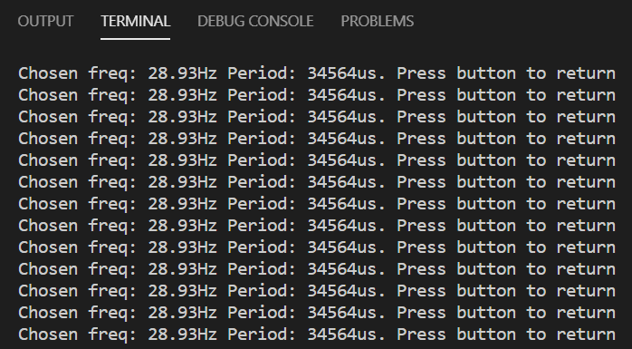

# Flicker Fusion Threshold Assignment Project Report

## 1. Abstract

This is a project for the 2020 Embedded Systems class at WelTec. The purpose of this project is to construct a prototype of an embedded system to determine the frequency of a person's subjective flicker fusion threshold. I constructed this project on a breadboard with a Teensy 3.2 development board, push button, and a 10kOhm potentiometer. The program allows the user to scroll through frequencies of a flickering LED until they find their subjective flicker fusion threshold, where they can press the pushbutton to display their chosen frequency on the serial monitor. The flicker frequency was verified using a SerialPlot program and it was found that at frequencies; 25.24Hz and 57.22Hz, the error between the programs frequencies and measured frequencies were -0.95% and 0.05% respectively. However, it is unknown exactly how accurate the frequencies were without an oscilloscope. I believe the purpose of this project was fulfilled. A video demonstration for this system can be found [here](https://youtu.be/JD2qBTWrE_s).

## 2. Introduction

The purpose of this project is to construct a prototype of an embedded system to determine the frequency of a person's subjective flicker fusion threshold. "The flicker fusion threshold, or flicker fusion rate, is a concept in the psychophysics of vision. It is defined as the frequency at which an intermittent light stimulus appears to be completely steady to the average human observer" (Wikipedia, 2003).

The system prototype I contructed is based off of a Teensy 3.2 microcontroller, which is breadboarded along with a push button and 10kohm potentiometer. When uploaded, the program blinks the teensy's in-built LED with a 50% duty-cycle. The frequency of the blinking LED is proportional to the position of the potentiometer wiper, starting at the lowest frequency. Once the user finds the frequency at which they cannot see blinking, they press the pushbutton. This will output a message to a serial monitor showing the chosen frequency, and a prompt to press the button to return to adjusting the frequency.

The system uses the teensy's built-in LED because I did not have the right components, nor a multimeter to check the resistors' values I did have. This report will include a demonstration of how I would calculate the current-limiting resistor value for the LED to compensate.

The program was created initially in several smaller programs to prove functionalities; debouncing the button with an external interrupt, mapping the potentiometer analogue to digital (ADC) reading to a certain range, and mapping the ADC reading to the LED blink frequency. The frequency was tested using a serial plotter to plot the wavform.

## 3. Methods

### 3.1 Determining Current Limiting Resistor

According to the [teensy's datasheet](Project_media/Datasheets/MK20DX64VLH7_Datasheet.pdf), the single pin current limit is 25mA. I chose [this LED datasheet](Project_media/Datasheets/element14_1003210_LED.pdf) as I have used it for another course. As shown in figure 1 below, a current of 10mA was chosen because it should still operate at (worst case) 90 degrees Celsius ambient temperature, it gives a decent relative luminous density, and it is below half the single pin current limit of the microcontroller. This gave a forward voltage of 1.75 volts.


*_Figure 1:_ Forward voltage and current selection*

Using the parameters above, the series resistor value could be calculated using the equation in figure 2 below.


*_Figure 2:_ Series Resistor Calculations*

### 3.2 Breadboarding the System

The microcontroller is powered by the USB 5V supply. The system needed an LED (which was built-in), a potentiometer, a pushbutton, and the necessary jumper wires. I chose pin A0 for the potentiometer as it needed to connect to an ADC module, pin 12 for the push button as it was in a convenient position, and added the jumper wires to connect the components according to [this Eagle schematic](Schematic/Flicker_Fusion_schematic.PNG). The pushbutton makes use of the internal pullup resistor function in the microcontroller since I was unable to check the value of resistors I had. Figure 3 below shows this system.


*_Figure 3:_ Bread-boarded embedded system*

### 3.3 Writing the program

I first broke the program into several smaller programs to make sure I could get them to work individually. This saved time on troubleshooting issues in the main program. I started off by using an example of [button debouncing with an external interrupt](Test_projects/Debounce_with_E_interrupt) from in-class.

After verifying that that the button debounce code worked, I went on to map the potentiometer ADC reading to a specific range in a [separate program](Test_projects/Map_pot).

I built off of the mapping code to enable mapping of the period of a blinking LED in [another separate program](Test_projects/PotMappedToPWM). My approach to blinking the LED was to flip the state of the LED for each cycle of the main loop in the program. This meant that the scan time of the program had to be half that of the blinking period for a full cycle. I chose to do it this way because it is simpler than writing out separate on and off times for the LED. But this also meant that the duty cycle could only be 50%, which worked in favour of the project.

This led to compiling the smaller programs together to produce the [finished program](Flicker_Fusion_Theshold_v2). The period of the flickering LED is mapped to the potentiometer ADC reading. The frequency is calculated from the period and outputted to the serial monitor at 115200 baud rate. Once the user scrolls to their subjective flicker fusion threshold, they can press the pushbutton which saves the frequency and is outputted to the serial monitor. The pushbutton can be pressed again to return to the frequency selection. I chose to map the potentiometer reading to the period rather than the frequency so that it would be simpler to configure the scan time. This way, the actual frequency would be depending on a more accurate microsecond value instead of depending on a calculated floating point variable with double precision. I chose to have the scan time in microseconds for extra precision if needed compared to milliseconds.

### 3.4 Testing the Actual Frequency

I had no oscilloscope available, nor a multimeter with frequency measuring capabability, so I had to use a Serial Plotter. In the main loop of the program, there are two PWM plot points:

```cpp
//PWM plot point 1
 Serial.println(ledState);

 //Toggle LED state
 ledState = !ledState;
 digitalWrite(ledPin,ledState);

 //PWM plot point 2
 Serial.println(ledState);
 ```

One is directly before the led state change and one directly after. It produces half of the square wave, so another loop cycle completes it. These 4 plotted points correspond to the 4 points shown in Figure 4 below. The resulting signal that was plotted is shown in Figure 5. It should be noted that the resulting signal is trapezoidal rather than square. I tried a faster baud rate but this did not change the the shape.


*_Figure 4:_ Square wave drawn by tutor Frank Beinersdorf*


*_Figure 5:_ Serial plotter signal output*

The Serial plotter included a 'samples per second' value which was useful for calculating the measured frequency. I recorded the Serial Plotter response at a lower frequency (25.24Hz) and higher frequency (57.22Hz) and put them in a [PowerPoint File](Project_media/Results/Flicker_Fusion_Threshold_Timing_Results.pptx). The program's displayed frequency was considered as the theoretical value, and the plotted frequency was considered as the experimental value. The error between these were calculated in figure 6 below.


*_Figure 6:_ Frequency error calculations*

## 4. Results

### 4.1 Series Resistor value

Series resistor value = 160Ohms

### 4.2 Serial Monitor Output

The current frequency is displayed in VS Code's serial monitor as shown in figure 7 below.


*_Figure 7:_ Serial monitor output - current Frequency Screenshot*

The chosen frequency and period is displayed in the serial monitor along with a prompt to return as shown in figure 8 below.



*_Figure 8:_ Serial Monitor - Chosen Frequency Screenshot*

### 4.2 Frequency Errors

At 25.24Hz, the error was -0.95%

At 57.25Hz, the error was 0.05%

## 5. Discussion

I believe this project met the task description sufficiently, however it was difficult to verify the system's frequency readings. It is unknown how long it takes to write to the serial monitor, and how the SerialPlot program samples the signal as it automatically sets the sample rate. I believe the trapezoidal wave produced is directly related to the sample rate because there is 1 sample between each logic transition as shown in figure 7 below. It seems this is a limitation of the SerialPlot program. I was satisfied with the frequency values, but it is unknown how accurate they are.


*_Figure 9:_ Trapezoidal wave example*

A downside to mapping the potentiometer to the period is that the relationship between the frequency and the period is non linear. As the period decreases, the frequency increases exponentially. This could be changed in the future for a more linear response.

The series resistor value was calculated as 155 Ohms, but the nearest preferred value rounded up was 160 Ohms according to [this table](Project_media/Datasheets/Standard_resistor_values.pdf) (McClure, n.d.). I chose the upper nearest resistor value because it is safer to have a lower current flowing rather than higher.

I found that the breadboard connections were not very reliable as the jumper wires would wiggle in the breadboard sockets. This was particularly a problem with the pushbutton jumpers, where the wire would have to be held down for a reliable connection. This could be mitigated by using a different breadboard, or moving the prototype onto stripboard.

A video demonstration of this system can be found at [this link](https://youtu.be/JD2qBTWrE_s)

## 6. References

McClure, L. (n.d.). Standard Resistor Values. Electrical, Computer & Energy Engineering | University of Colorado Boulder. <https://ecee.colorado.edu/~mcclurel/resistorsandcaps.pdf>

Wikipedia. (2003, December 19). Flicker fusion threshold. Wikipedia, the free encyclopedia. Retrieved May 1, 2020, from <https://en.wikipedia.org/wiki/Flicker_fusion_threshold>
